# 💰 SISTEM PENCATATAN KEUANGAN
---

## 📋 Deskripsi Project

**Sistem Pencatatan Keuangan** adalah aplikasi web modern yang dirancang khusus untuk memudahkan pencatatan dan pelaporan keuangan organisasi. Website ini dibangun dengan fokus pada kemudahan penggunaan, keamanan data, dan transparansi keuangan organisasi.                              

### 📌 Informasi Project

| Aspek | Detail |
|-------|--------|
| **Nama Project** | Sistem Pencatatan Keuangan|
| **Author** | Aziza Firdaus |
| **NPM** | 23552011059 |
| **Kelas** | TIF RP 23 CNS B - Web Programming 1 |
| **Institusi** | Universitas Teknologi Bandung |
| **Versi** | 1.0.0 |
| **Tahun** | 2025 |

---

## ✨ Fitur Utama

### Halaman Utama (Homepage)
- Hero section dengan gradient aesthetic yang memukau
- 6 information cards dengan icon menarik (Laporan, Pemasukan, Pengeluaran, Anggaran, Audit, Kontak)
- Informasi lengkap tentang keuangan organisasi
- Call-to-action button untuk login
- Fully responsive design di semua perangkat

### Halaman Detail Informasi
- Detail komprehensif untuk setiap kategori informasi
- Smooth transition animations
- Navigation yang mudah kembali ke halaman utama
- Content yang clean dan readable
- Format informasi yang terstruktur

### Sistem Autentikasi

#### Login Page
- Form login dengan username & password
- Validasi ketat menggunakan IF statements
- Error messages yang user-friendly dan informatif
- Redirect otomatis ke dashboard setelah login sukses
- Link ke halaman registrasi untuk akun baru

#### Register Page
- Form pendaftaran untuk akun baru
- Validasi lengkap setiap field form
- Password confirmation check
- Deteksi duplicate username & email
- Keamanan password yang terenkripsi

### Dashboard Keuangan
- Welcome message yang personalized dengan nama user
- Statistics cards menampilkan (Total Pemasukan, Total Pengeluaran, Saldo Kas)
- Transactions table dengan status badges berwarna
- Data visualization yang professional
- Logout button untuk keluar dari sistem

### Dark Mode / Light Mode
- Toggle theme button di header aplikasi
- Smooth color transition saat berganti tema
- Persistent preference tersimpan ke LocalStorage
- Full dark mode support di semua halaman aplikasi

### Responsive Design
- Mobile-first approach dalam design
- Support untuk semua screen sizes (320px - 1920px)
- Touch-friendly interface untuk mobile devices
- Grid & Flexbox layout yang adaptive
- Tested di berbagai ukuran layar

---

## 🛠️ Teknologi yang Digunakan

### Frontend Stack
```
📌 HTML5        - Semantic markup & structure
📌 CSS3          - Modern styling dengan:
                   • CSS Grid & Flexbox
                   • Gradients & Animations
                   • CSS Variables untuk theme
                   • Responsive Media Queries
                   • Dark Mode Support
📌 JavaScript    - Vanilla JS (Tanpa Framework)
                   • OOP Classes untuk struktur code
                   • State Management terpusat
                   • Event Handling yang efisien
                   • LocalStorage API untuk persistence
```

---

## 📝 Struktur Project
```
UTS_WEB1/
├── api/                             # Backend API berbasis PHP
│   ├── flow/                        # Proses CRUD utama
│   │   ├── delete_data.php          # Menghapus data dari database
│   │   ├── get_data.php             # Mengambil data dari database
│   │   ├── insup_data.php           # Insert & update data
│   │
│   ├── koneksi/                     # Konfigurasi koneksi database
│   │   └── connection.php           # File koneksi ke database MySQL
│   │
│   └── photo/                       # Endpoint file foto
│       └── index.php                # Handler upload/akses foto
│
├── assets/                          # File pendukung (gambar/screenshot)
│   ├── bruno_screenshots/           # Screenshot pengujian API via Bruno
│   └── web_screenshots/             # Screenshot tampilan web
│
├── src/                             # Sumber utama frontend
│   ├── css/                         # Style CSS
│   │   ├── animations.css           # Efek animasi UI
│   │   ├── components.css           # Style komponen UI
│   │   ├── main.css                 # Style global
│   │   ├── responsive.css           # Style untuk tampilan responsif
│   │   └── variables.css            # Variabel CSS (color, size, dll)
│   │
│   ├── data/                        # Data statis
│   │   └── detaildata.js            # File data detail (dummy/statik)
│   │
│   ├── js/                          # Logika aplikasi JavaScript
│       ├── utils/                   # Kumpulan fungsi utilitas
│       │   ├── constants.js         # Constant global
│       │   ├── helpers.js           # Fungsi helper umum
│       │   ├── storage.js           # Pengelolaan localStorage/session
│       │   └── validators.js        # Validasi input/form
│       │
│       ├── app.js                   # Entry point aplikasi
│       ├── auth.js                  # Logika autentikasi (login/logout)
│       ├── components.js            # Render komponen UI
│       ├── navigation.js            # Navigasi antar halaman/section
│       └── state.js                 # State management aplikasi
│
├── index.html                       # Halaman utama frontend
├── package.json                     # Konfigurasi Node (jika digunakan)
└── README.md                        # Dokumentasi project

```

---

## 💻 Validasi Form dengan IF Statements

### Alur Login Validation
```javascript
IF username kosong
   → Tampilkan error: "Username tidak boleh kosong"

ELSE IF password kosong
   → Tampilkan error: "Password tidak boleh kosong"

ELSE IF format username invalid
   → Tampilkan error: "Format username tidak valid"

ELSE IF password < 6 karakter
   → Tampilkan error: "Password minimal 6 karakter"

ELSE IF user tidak ditemukan di database
   → Tampilkan error: "Username atau password salah"

ELSE IF password tidak sesuai dengan yang tersimpan
   → Tampilkan error: "Username atau password salah"

ELSE
   → Login BERHASIL
   → Tampilkan success message
   → Simpan session user
   → Redirect ke Dashboard
```

### Alur Register Validation
```javascript
IF username kosong
   → Error: "Username tidak boleh kosong"

ELSE IF username < 3 karakter
   → Error: "Username minimal 3 karakter"

ELSE IF username tidak sesuai format
   → Error: "Username hanya boleh alfanumerik, dash, dan underscore"

ELSE IF email kosong
   → Error: "Email tidak boleh kosong"

ELSE IF email invalid (tidak ada @)
   → Error: "Format email tidak valid"

ELSE IF password kosong
   → Error: "Password tidak boleh kosong"

ELSE IF password < 6 karakter
   → Error: "Password minimal 6 karakter"

ELSE IF password ≠ confirm password
   → Error: "Konfirmasi password tidak cocok"

ELSE IF username sudah terdaftar
   → Error: "Username sudah terdaftar"

ELSE IF email sudah terdaftar
   → Error: "Email sudah terdaftar"

ELSE
   → Register BERHASIL
   → Simpan akun ke database
   → Tampilkan success message
   → Redirect ke Login
```

---

## 📁 Database
```
CREATE TABLE users (
    id INT AUTO_INCREMENT PRIMARY KEY,
    username VARCHAR(50) UNIQUE NOT NULL,
    email VARCHAR(100) UNIQUE NOT NULL,
    password VARCHAR(255) NOT NULL,
    created_at TIMESTAMP DEFAULT CURRENT_TIMESTAMP,
    updated_at TIMESTAMP DEFAULT CURRENT_TIMESTAMP ON UPDATE CURRENT_TIMESTAMP
) ENGINE=InnoDB DEFAULT CHARSET=utf8mb4;

CREATE TABLE transactions (
    id INT AUTO_INCREMENT PRIMARY KEY,
    user_id INT NOT NULL,
    tanggal DATE NOT NULL,
    keterangan VARCHAR(255) NOT NULL,
    kategori ENUM('Pemasukan', 'Pengeluaran') NOT NULL,
    jumlah DECIMAL(15,2) NOT NULL,
    status VARCHAR(50) DEFAULT 'Pending',
    created_at TIMESTAMP DEFAULT CURRENT_TIMESTAMP,
    updated_at TIMESTAMP DEFAULT CURRENT_TIMESTAMP ON UPDATE CURRENT_TIMESTAMP,
    FOREIGN KEY (user_id) REFERENCES users(id) ON DELETE CASCADE
) ENGINE=InnoDB DEFAULT CHARSET=utf8mb4;
```

---

## 📸 Screenshots Tampilan Web

### Beranda
- Light Mode
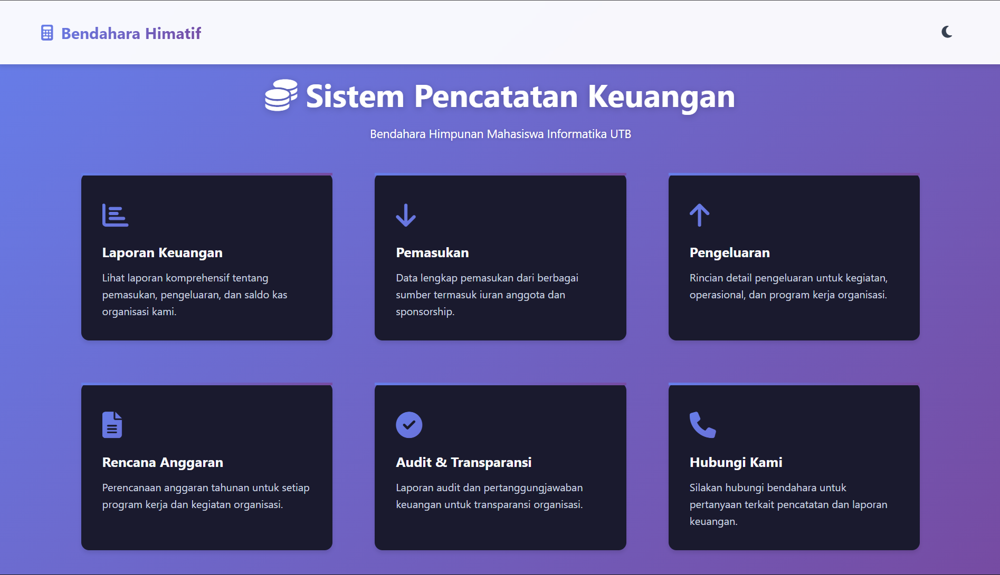

- Dark Mode
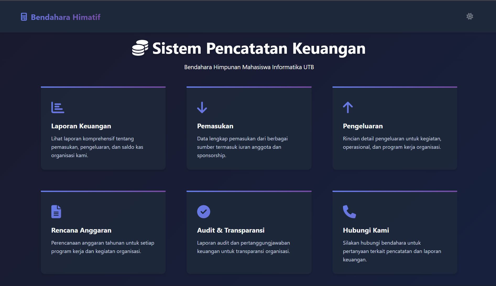

### Detail Informasi
- Light Mode
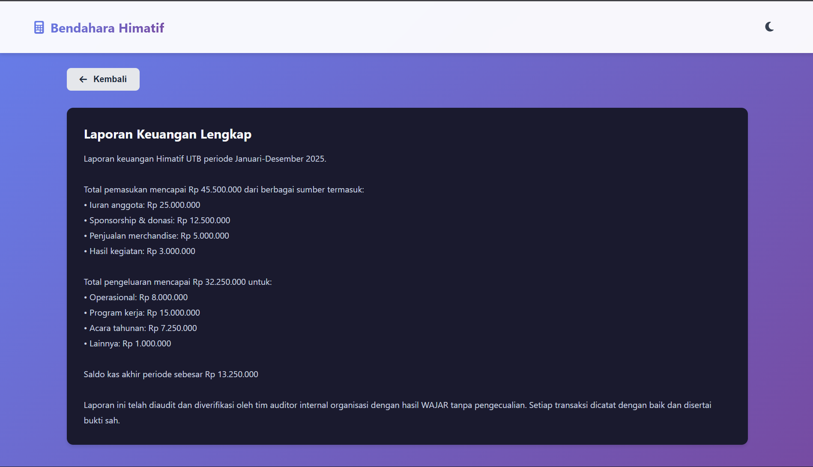

- Dark Mode
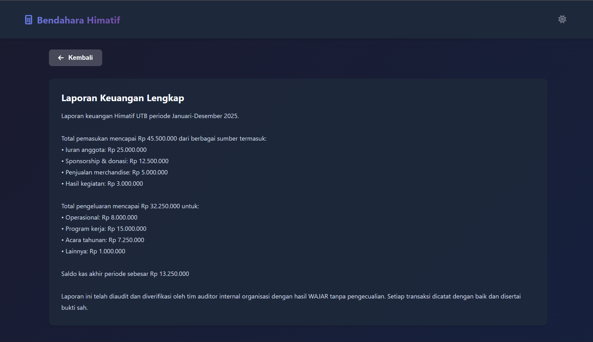

### Register
- Light Mode
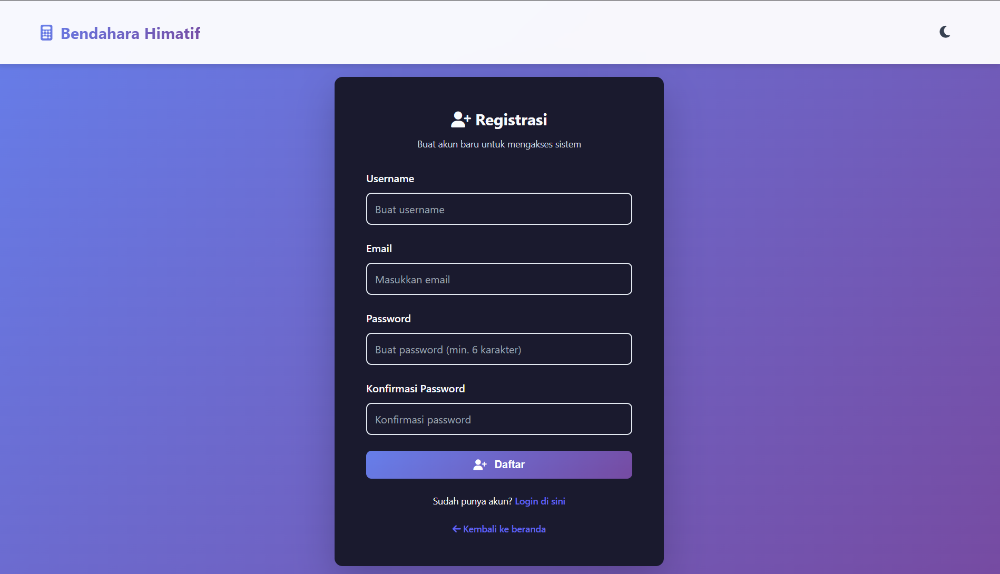

- Dark Mode
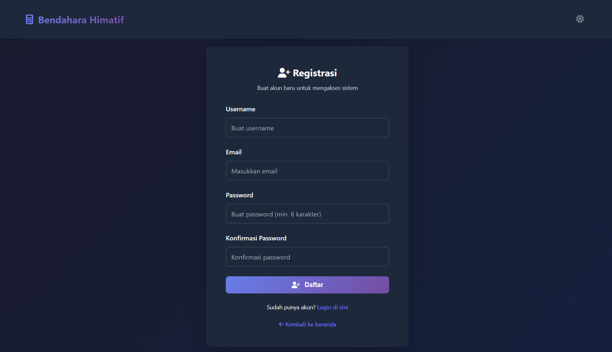

### Login
- Light Mode
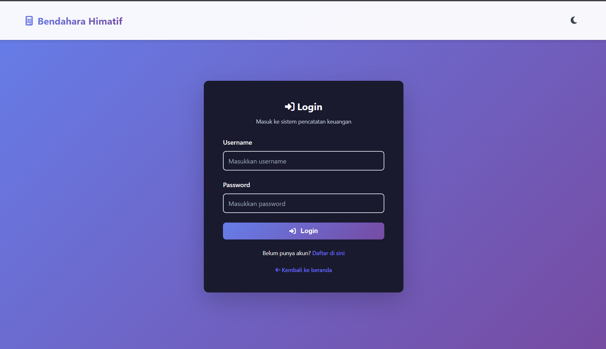

- Dark Mode
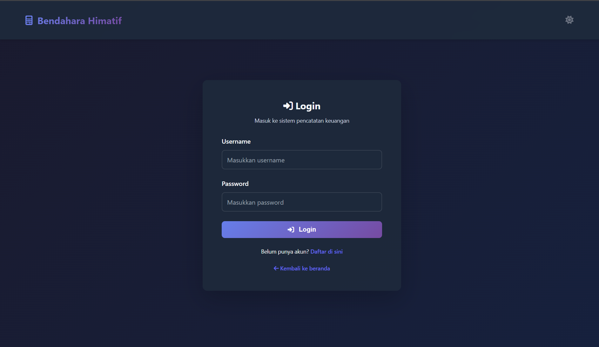

### Dashboard
- Light Mode
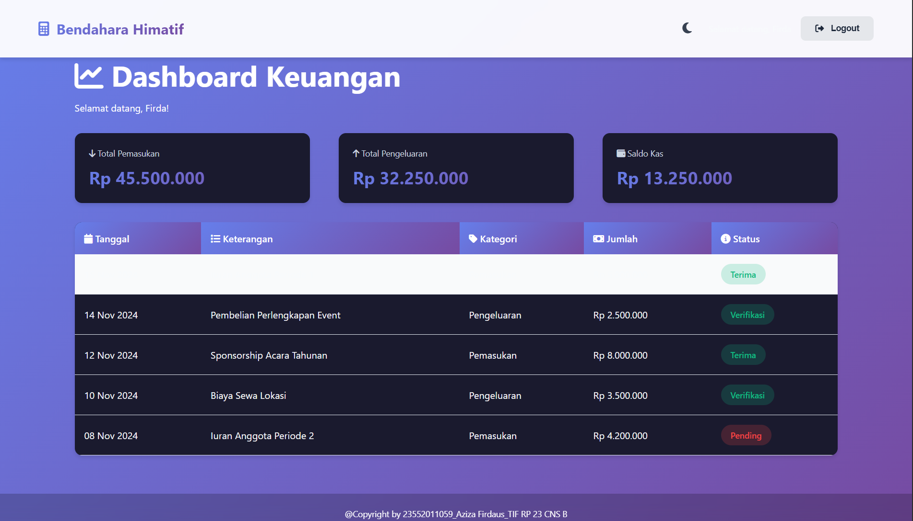

- Dark Mode
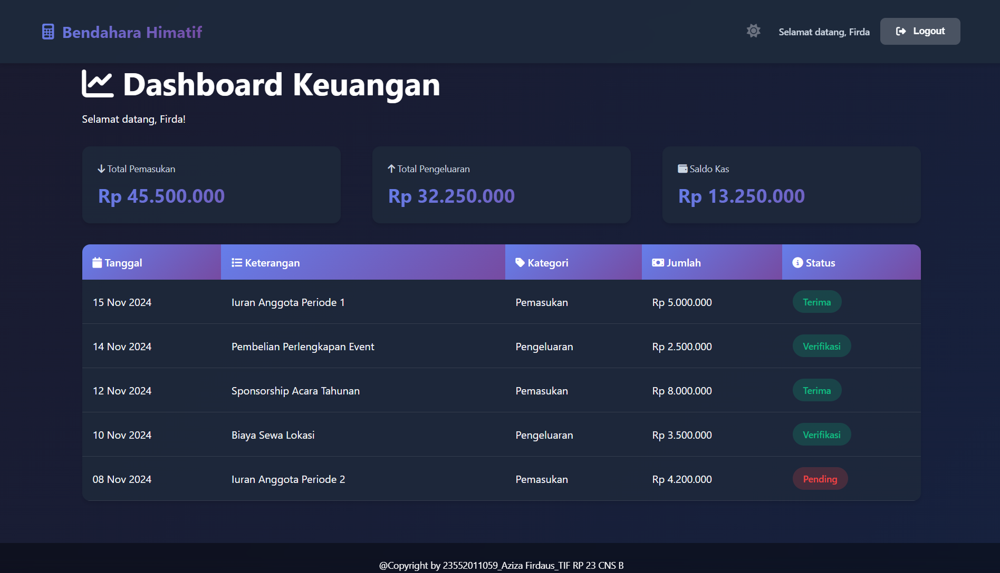

---

## 📸 Screenshots Tampilan BRUNO

### Create
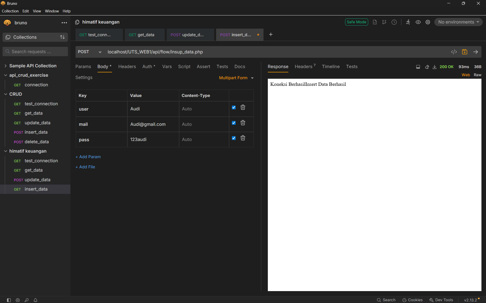

### Read
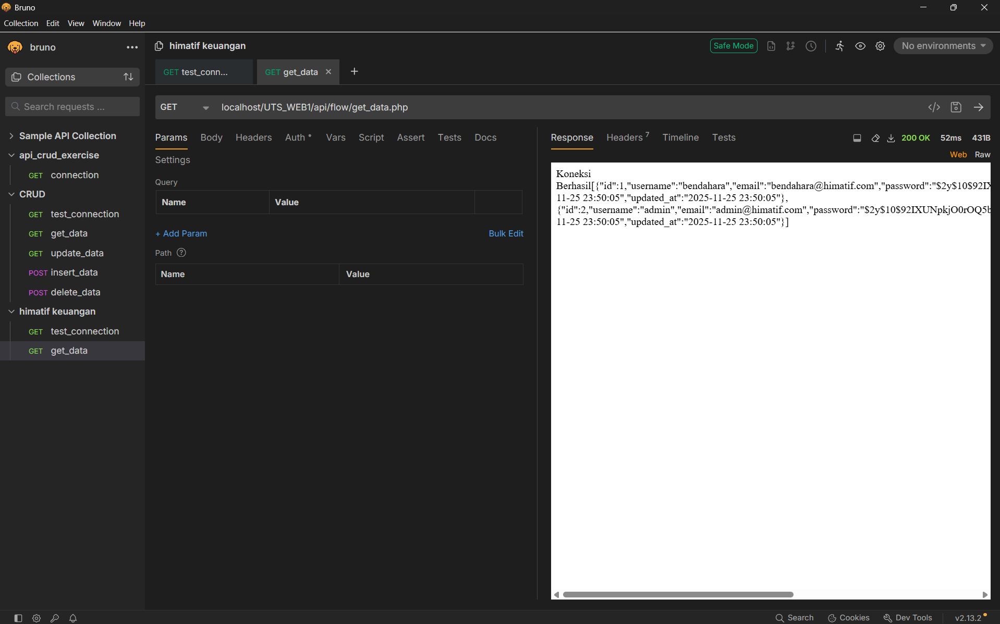

### Update
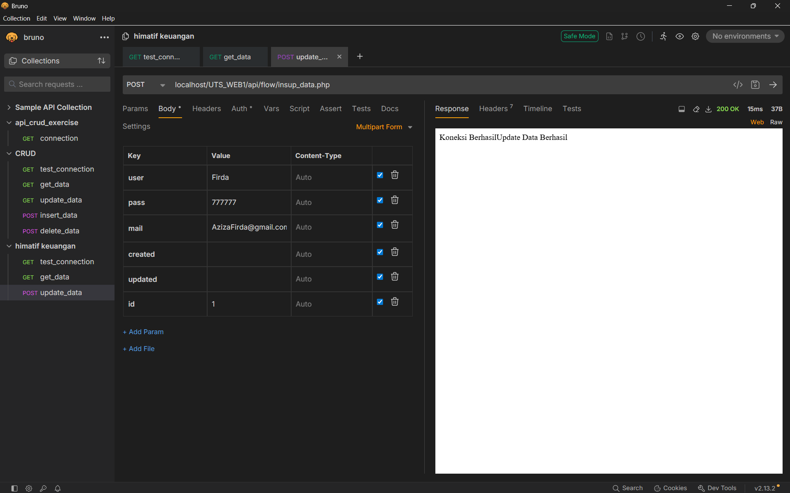

### Delete
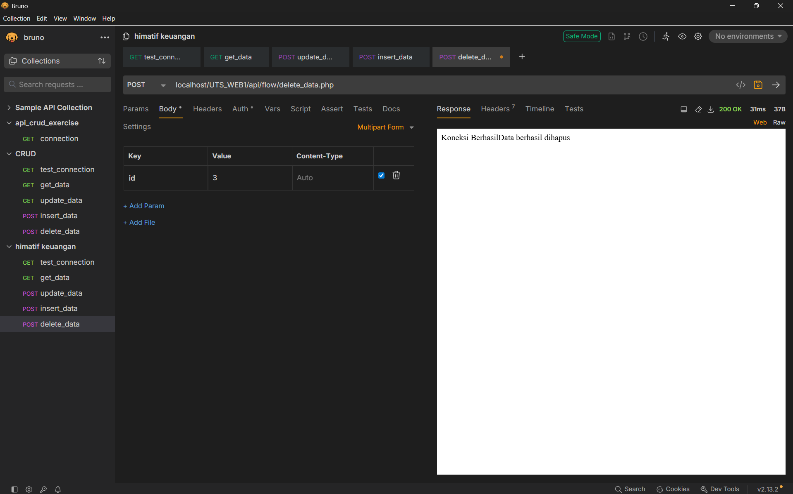

---

<div align="center">
  
### 🎉 Terima Kasih

### Dibuat dengan ❤️ untuk Himatif UTB

**Versi 1.0.0** — 2025

</div>


